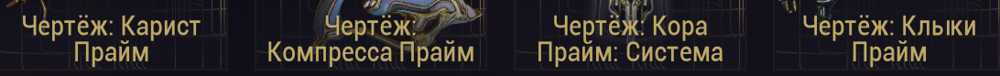

# Warframe Reward Price Checker (для Linux)

Скрипт на Python для игроков Warframe на **Linux**, который автоматически проверяет цены на награды с экрана выбора после миссии.

Этот инструмент создан как альтернатива популярным Windows-программам (таким как Warframe Info, AlecaFrame), которых часто не хватает в Linux-сообществе. Особое внимание уделено стабильной работе в окружении **Wayland**, так как скрипт не использует сторонние средства захвата экрана, а просто отслеживает появление новых файлов в папке.

## Как это работает?

Вы помещаете скрипт в вашу папку для скриншотов. После запуска он начинает "следить" за этой папкой. Как только вы делаете в игре новый скриншот, он автоматически сохраняется в эту папку, скрипт его тут же обнаруживает, распознаёт названия предметов и выводит их цены в консоль. **Всё происходит автоматически.**

---

## Важно: Как правильно делать скриншот

Для корректной работы скрипта крайне важно, чтобы в область вашего скриншота попали **только названия четырех наград**. Не нужно захватывать весь экран.

**Правильный пример (`items.png`):**


Захватите только ту область, где расположены названия предметов, как показано на изображении выше. Любые лишние элементы интерфейса могут помешать распознаванию.

---

## Установка и Настройка

Идея в том, чтобы скрипт лежал прямо в папке, куда у вас по умолчанию сохраняются все скриншоты.

1.  **Скачайте файлы репозитория.**
    Нажмите зелёную кнопку `<> Code` -> `Download ZIP` или клонируйте репозиторий:
    ```bash
    git clone https://github.com/ВАШ_НИК/ВАШ_РЕПОЗИТОРИЙ.git
    ```

2.  **Найдите вашу папку для скриншотов.**
    Обычно это `~/Изображения/Снимки экрана` или `~/Pictures/Screenshots`, но может быть и другая.

3.  **Скопируйте файлы в эту папку.**
    Переместите следующие файлы из скачанного репозитория в вашу папку для скриншотов:
    - `main.py`
    - `requirements.txt`
    - `items.png` (для примера)

4.  **Установите зависимости.**
    Откройте терминал **именно в вашей папке для скриншотов** (клик правой кнопкой -> "Открыть в терминале" или командой `cd ~/Изображения/Снимки\ экрана/`) и выполните:
    ```bash
    # Рекомендуется сначала создать виртуальное окружение
    python -m venv venv
    source venv/bin/activate

    # Установка библиотек
    pip install -r requirements.txt
    ```
    *Примечание: При первом запуске EasyOCR может автоматически скачать модели для распознавания, что займёт некоторое время.*

---

## Использование

1.  **Запустите скрипт.**
    Откройте терминал в вашей папке для скриншотов и выполните:
    ```bash
    python main.py
    ```
    Вы увидите сообщение, что наблюдатель запущен. Теперь этот терминал можно свернуть.

2.  **Играйте в Warframe.**
    Как обычно, проходите миссии.

3.  **Сделайте скриншот.**
    На экране выбора наград сделайте скриншот **только области с названиями**. Он автоматически сохранится в вашу папку.

4.  **Смотрите результат!**
    Скрипт в терминале мгновенно обнаружит новый файл и выведет цены. Вам не нужно ничего больше делать.

## Как читать цены?

Скрипт запрашивает **5 самых низких цен** у продавцов, которые имеют статус "в сети" (`online`) или "в игре" (`in-game`) на Warframe.Market.

Это не полная статистика, а скорее срез актуальных предложений от активных игроков. Как по мне, это лучший способ примерно определить цену, за которую можно **сразу** продать предмет, не ожидая долго.
